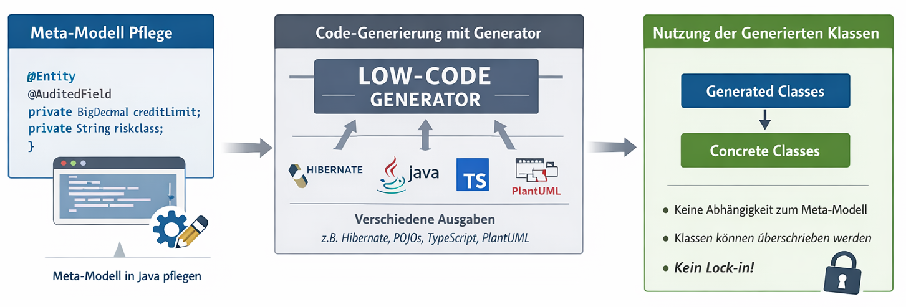
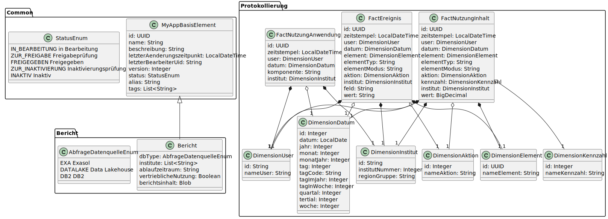

# zebLowCode
ZebLowCode ist eine Sammlung an Modulen die bei der Entwicklung von Software helfen. 
Die Idee ist, dass das Domänenmodell per Builderpattern in Javacode abgebildet wird und daraus für Zielsprachen und Frameworks konkrete Implementierungen generiert werden können.

# Umfang Version 0.1
- Komplette JPA / Spring Data / Hibernate 6 Persistenz
- Domänenmodell in Java und Typescript

# Ablauf

Als Verwender sollte man sich ein Modell-Projekt bauen. In diesem liegen alle Modellklassen die das Domänenmodell abbilden. Aus dem Modellprojekt heraus wird der relevante Code generiert und dann in produktiven Modulen genutzt.

Ein Beispielprojekt liegt unter lowcode.example. Dort findet sich ein Modellprojekt mit einer einfachen Domäne, bestehend aus einem Bericht und einer Protokollierung für Änderungen am Bericht. Aus diesem Modell werden dann die JPA-Entitäten generiert, die in einem Spring Boot Projekt genutzt werden können.

# Produktiver Einsatz
Die generierten Klassen können in produktiven Modulen genutzt werden. Es ist auch möglich, die generierten Klassen zu erweitern, um zusätzliche Funktionalitäten hinzuzufügen. Es ist jedoch wichtig, dass die generierten Klassen nicht direkt verändert werden, da sie bei jeder Generierung überschrieben werden können. Stattdessen sollten Erweiterungen in separaten Klassen erfolgen, die von den generierten Klassen erben oder diese nutzen.
